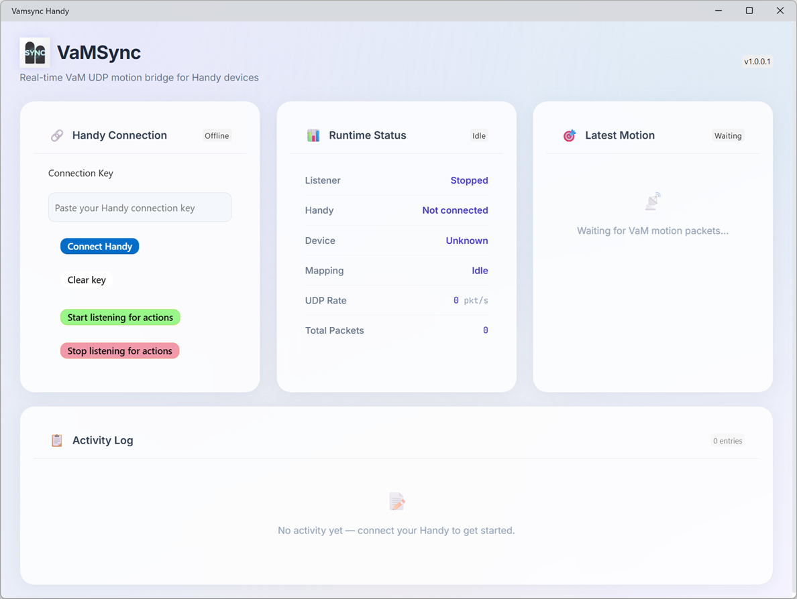
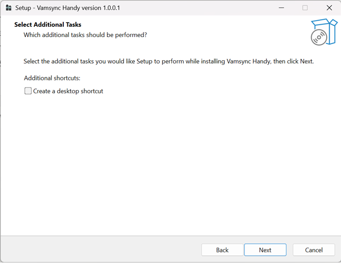

# VaMSync Handy

VaMSync Handy is a Windows desktop app that acts as a drop in replacement for the VaMSync application for handy users. Instead of using the legacy bluetooth control with Buttplug.io, it uses the modern Handy API v3 via Handy Direct Streaming Protocol (HDSP) operations. This should mean much better device movement, connection speed, connectively and reliability with the existing VAMLaunch Plugin. The application also supports TCode(v0.3) movement data via UDP with the ToySerialController plugin, modified to work with the handy. Just configure the correct UDP ouput target along with ip and port inside the ToySerialController plugin for this to work.




## What It Does

- Connects to a Handy device using your Handy connection key
- Listens for real-time motion data from VaM over UDP on 127.0.0.1:15601
- Converts incoming motion into Handy HDSP/XPT movement commands.
- Supports UDP TCode-style motion updates as well as VamLaunch UDP motion.
- Shows live status, latest motion, and an activity log from the handy.
- In the event of a device error simply press the wifi button on the handy and it should reconnect automatically. 
- Checks GitHub Releases for app updates and can open the latest download page.

## Installation And Running

Simply download and install the programme from [GitHub Releases](https://github.com/michael-b-tt0/Vamsync_Handy/releases):



Once this is installed, make sure you have an existing VAMLaunch Plugin in your vam install folder.

Then simply run the app, add your connection key and listen for movement actions!


## Requirements

- Windows 10 or later
- A Handy device and valid Handy connection key with firmware v4 or later
- An existing installed VAMLaunch Plugin or ToySerialController plugin or ToySerialController+VAMLaunch will all work with this application.


## Getting Started

1. Install the latest release from the GitHub Releases page.
2. Launch `Vamsync Handy`.
3. Paste your Handy connection key into the app.
4. Click `Connect Handy` to verify the connection.
5. Click `Start listening for actions`.
6. Start sending motion data from your VaM setup.

## Building From Source

This project is a .NET MAUI Blazor Hybrid app targeting Windows.

### Prerequisites

- .NET 10 SDK
- MAUI Windows workload
- Windows development environment with MAUI support
- Access to the referenced [handyapiv3](https://github.com/michael-b-tt0/handyapiv3c-) project used by this solution

### Build

```powershell
dotnet build Vamsync.csproj
```

### Run

```powershell
dotnet run --project Vamsync.csproj
```

## Notes

- The app requires internet access because it communicates with Handy services and checks for updates.
- If no GitHub releases have been published yet, the update checker stays quiet until a release exists.
